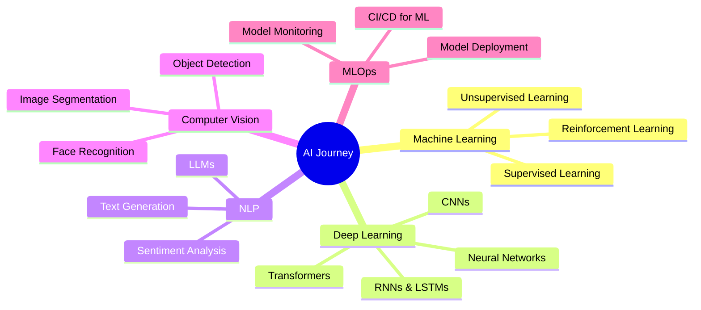

<div align="center">

# 🚀 Welcome to Amit's AI Universe 🤖
</div>

<!-- Top-right circular avatar GIF -->
<div align="right">
  
</div>


---

### 🎯 About Me

</div>

```python
class AmitTalmale:
    def __init__(self):
        self.name = "Amit Talmale"
        self.role = "AI Engineering Student"
        self.location = "India 🇮🇳"
        self.interests = [
            "Machine Learning",
            "Deep Learning",
            "Natural Language Processing",
            "Computer Vision"
        ]
        self.current_focus = "Building AI-powered real-world applications"
        self.learning = ["Transformers", "LLMs", "MLOps"]

    def say_hi(self):
        print("👋 Thanks for dropping by! Let's build something amazing together!")
```
<div align="center">
---

### 🛠️ Tech Stack & Tools


#### 🤖 AI/ML


#### 💻 Development


#### 🗄️ Databases & Cloud


---

### 📊 GitHub Analytics

<p align="center">


</p>

<p align="center">

</p>

<p align="center">

</p>

---

### 🏆 GitHub Trophies

<p align="center">

</p>

---

### 🔥 Current Focus



---

### 📈 Contribution Graph


---

### 🎓 Learning Path

<table>
<tr>
<td width="50%">

#### 🔬 Currently Learning
- 🧠 Large Language Models (LLMs)
- 🤖 Transformer Architecture
- 📊 MLOps & Model Deployment
- 🔄 Generative AI
- ☁️ Cloud AI Services

</td>
<td width="50%">

#### 🎯 Next Goals
- 🚀 Contribute to Open Source AI
- 📝 Write Technical Blogs
- 🏗️ Build Production ML Systems
- 🎤 Speak at Tech Events
- 🤝 Collaborate on AI Projects

</td>
</tr>
</table>

---

### 🌐 Connect With Me

<p align="center">
<a href="https://linkedin.com/in/amit-talmale" target="_blank">

</a>
<a href="https://twitter.com/amit_talmale" target="_blank">

</a>
<a href="https://github.com/amittalmale" target="_blank">

</a>
<a href="mailto:amit.talmale@example.com" target="_blank">

</a>
<a href="https://kaggle.com/amittalmale" target="_blank">

</a>
</p>

---

### 💡 Random Dev Quote

<p align="center">

</p>
---


### 💖 Thanks for visiting! Let's connect and build something amazing! 🚀


</div>
